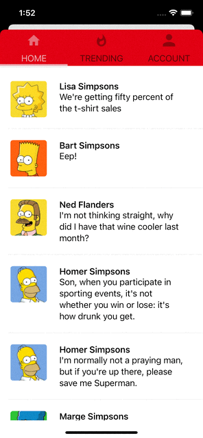

# PagerTabStrip

<p align="left">
<a href="https://travis-ci.org/xmartlabs/PagerTabStrip"></a>

<a href="https://developer.apple.com/swift"></a>
<a href="https://github.com/Carthage/Carthage"></a>
<a href="https://cocoapods.org/pods/XLActionController"></a>
<a href="https://raw.githubusercontent.com/xmartlabs/PagerTabStrip/master/LICENSE"></a>
</p>

By [Xmartlabs SRL](http://xmartlabs.com).

## Introduction

[XLPagerTabStrip](https://github.com/xmartlabs/XLPagerTabStrip) for SwiftUI!

PagerTabStrip provides an interactive component that allows the user to navigate between pages using a custom navigation bar or swiping up. This powerful tool is totally built in SwiftUI native components.

<table>
  <tr>
    <th></th>
    <th></th>
    <th></th>
  </tr>
</table>

## Examples

Follow these 3 steps to run Example project: clone PagerTabStrip repository, open PagerTabStrip workspace and run the _Example_ project.

## Installation

### CocoaPods

[CocoaPods](https://cocoapods.org/) is a dependency manager for Cocoa projects.

To install PagerTabStrip, simply add the following line to your Podfile:

```ruby
pod 'PagerTabStrip', '~> 1.0'
```

### Carthage

[Carthage](https://github.com/Carthage/Carthage) is a simple, decentralized dependency manager for Cocoa.

To install PagerTabStrip, simply add the following line to your Cartfile:

```ogdl
github "xmartlabs/PagerTabStrip" ~> 1.0
```

## Requirements

- iOS 14+
- Xcode 12.X

## Usage

Creating a page view is super straightforward, you need to place your custom tab views into a `PagerTabStripView` view and apply the `pagerTabItem( _: )` modifier to each one to specify the navigation bar tab item.

```swift
import PagerTabStrip

struct PagerView: View {

    var body: some View {
        PagerTabStripView() {
            MyView()
                .pagerTabItem {
                    TitleNavBarItem(title: "Tab 1")
                }
            AnotherView()
                .pagerTabItem {
                    TitleNavBarItem(title: "Tab 2")
                }
            if User.isLoggedIn {
                ProfileView()
                    .pagerTabItem {
                        TitleNavBarItem(title: "Profile")
                    }
            }
        }
    }
}
```

<div style="text-align:center">
    
</div>

You can specify the index of the initial page shown in the `XLPagerView` through `selection` parameter in the initializer.

```swift
import PagerTabStrip

struct PagerView: View {
    @State var selection = 1

    var body: some View {
        PagerTabStripView() {
            MyView(selection: $selection)
                .pagerTabItem {
                    TitleNavBarItem(title: "Tab 1")
                }
            AnotherView()
                .pagerTabItem {
                    TitleNavBarItem(title: "Tab 2")
                }
            if User.isLoggedIn {
                ProfileView()
                    .pagerTabItem {
                        TitleNavBarItem(title: "Profile")
                    }
            }
        }
    }
}
```

### Customize pager style

You have the ability to customize some aspects of the navigation bar and its indicator bar using the `pagerTabStripViewStyle` modifier. The customizable settings are:

- Spacing between navigation bar items
- Navigation bar height
- Indicator bar height
- Indicator bar color

```swift
import PagerTabStrip

struct PagerView: View {

	var body: some View {
		PagerTabStripView(selection: 1) {
			MyView()
				.pagerTabItem {
					TitleNavBarItem(title: "Tab 1")
				}
			AnotherView()
				.pagerTabItem {
					TitleNavBarItem(title: "Tab 2")
				}
			if User.isLoggedIn {
				ProfileView()
					.pagerTabItem {
						TitleNavBarItem(title: "Profile")
                    }
			}
		}
        .pagerTabStripViewStyle(PagerTabViewStyle(tabItemSpacing: 0, tabItemHeight: 50, indicatorBarHeight: 2, indicatorBarColor: Color.gray))
	}
}
```

In this example, we add some settings like the tab bar height, indicator bar color and indicator bar height. Let's watch how it looks!

<div style="text-align:center">
    
</div>

## Navigation bar

The navigation bar supports custom tab items. You need to specify its appearance creating a struct that implements `View` protocol.

For simplicity, we are going to implement a nav bar item with only a title. You can find more examples in the example app.

```swift
struct TitleNavBarItem: View {
    let title: String

    var body: some View {
        VStack {
            Text(title)
                .foregroundColor(Color.gray)
                .font(.subheadline)
        }
        .frame(maxWidth: .infinity, maxHeight: .infinity)
        .background(Color.white)
    }
}
```

### Customize selected and highlighted items

You can define the style of your nav items when they are selected or highlighted by implementing `PagerTabViewDelegate` protocol in your nav item view.

In this example we are going to change the text and background color when the tab is highlighted and selected.

```swift
private class NavItemTheme: ObservableObject {
    @Published var textColor = Color.gray
    @Published var backgroundColor = Color.white
}

struct TitleNavBarItem: View, PagerTabViewDelegate {
    let title: String
    @ObservedObject fileprivate var theme = NavItemTheme()

    var body: some View {
        VStack {
            Text(title)
                .foregroundColor(theme.textColor)
                .font(.subheadline)
        }
        .frame(maxWidth: .infinity, maxHeight: .infinity)
        .background(theme.backgroundColor)
    }

    func setState(state: PagerTabViewState) {
        switch state {
        case .selected:
            self.theme.textColor = .blue
            self.theme.backgroundColor = .lightGray
        case .highlighted:
            self.theme.textColor = .pink
        default:
            self.theme.textColor = .gray
            self.theme.backgroundColor = .white
        }
    }
}
```

<div style="text-align:center">
    
</div>

## onPageAppear modifier

You can use this callback if you want to trigger some action when the user switches to this page, either by scrolling to it or tapping its tab. This modifier is applied to a specific page.

```swift
import PagerTabStrip

struct PagerView: View {

    var body: some View {
        PagerTabStripView(selection: 1) {
            MyView(model: myViewModel)
                .pagerTabItem {
                    TitleNavBarItem(title: "Tab 1")
                }
                .onPageAppear {
                    model.reload()
                }
        }
        .pagerTabStripViewStyle(PagerTabViewStyle(tabItemSpacing: 0, tabItemHeight: 50, indicatorBarHeight: 2, indicatorBarColor: Color.gray))
    }
}
```

## Author

- [Xmartlabs SRL](https://github.com/xmartlabs) ([@xmartlabs](https://twitter.com/xmartlabs))

## Getting involved

- If you **want to contribute** please feel free to **submit pull requests**.
- If you **have a feature request** please **open an issue**.
- If you **found a bug** or **need help** please **check older issues and threads on [StackOverflow](http://stackoverflow.com/questions/tagged/PagerTabStrip) (Tag 'PagerTabStrip') before submitting an issue**.

Before contribute check the [CONTRIBUTING](https://github.com/xmartlabs/PagerTabStrip/blob/master/CONTRIBUTING.md) file for more info.

If you use **PagerTabStrip** in your app We would love to hear about it! Drop us a line on [Twitter](https://twitter.com/xmartlabs).

# Changelog

See [CHANGELOG](CHANGELOG.md).
