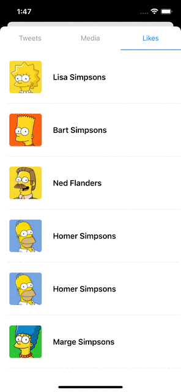
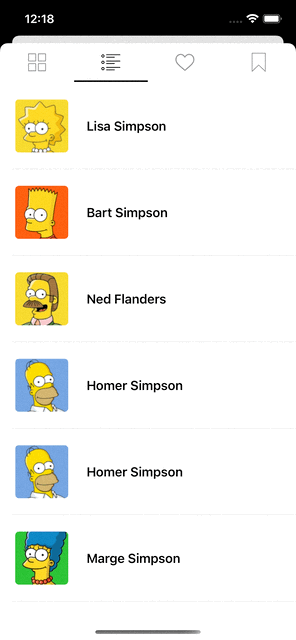
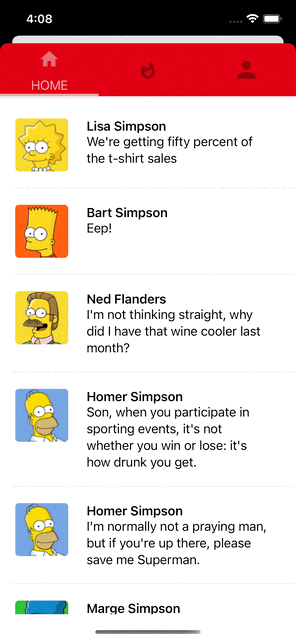
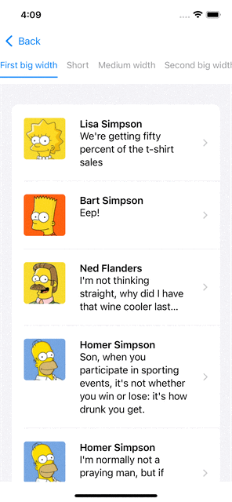
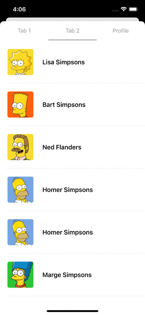
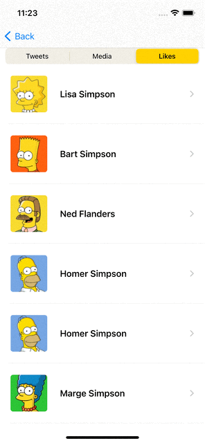
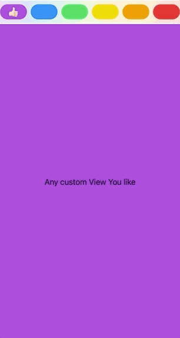

# PagerTabStripView

<p align="left">
<a href="https://github.com/xmartlabs/PagerTabStripView/actions/workflows/build-test.yml"></a>

<a href="https://developer.apple.com/swift"></a>
<a href="https://github.com/Carthage/Carthage"></a>
<a href="https://cocoapods.org/pods/PagerTabStripView"></a>
<a href="https://raw.githubusercontent.com/xmartlabs/PagerTabStripView/master/LICENSE"></a>
</p>

Made with :heart: by [Xmartlabs](http://xmartlabs.com) team. [XLPagerTabStrip](https://github.com/xmartlabs/XLPagerTabStrip) for SwiftUI!

## Introduction

PagerTabStripView is the first pager view built in pure SwiftUI. It provides a component to create interactive pager views which contains child views. It allows the user to switch between your views either by swiping or tapping a tab bar item.

<table>
  <tr>
    <th></th>
    <th></th>
    <th></th>
    <th></th>
  </tr>
</table>

Unlike Apple's TabView it provides:

1. Flexible way to fully customize pager tab views.
2. Each pagerTabItem view can be of different type.
3. Bar that contains pager tab item is placed on top.
4. Indicator view indicates selected child view.
5. Ability to update pagerTabItem according to highlighted, selected, normal state.
6. Ability to embed one page within another and not breaking scroll behavior. 
7. Ability to update UI according page selection and transition progress among pages. 

## Usage

Creating a page view is super straightforward, you just need to place your custom tab views into a `PagerTabStripView` view and apply the `pagerTabItem` modifier to each one to specify its navigation bar tab item.
The `tag` parameter is the value to identify the tab item. It can be any Hashable value and it must be unique.

```swift
import PagerTabStripView

struct MyPagerView: View {

    var body: some View {

        PagerTabStripView() {
            MyFirstView()
                .pagerTabItem(tag: 1) {
                    TitleNavBarItem(title: "Tab 1")
                }
            MySecondView()
                .pagerTabItem(tag: 2) {
                    TitleNavBarItem(title: "Tab 2")
                }
            if User.isLoggedIn {
                MyProfileView()
                    .pagerTabItem(tag: 3) {
                        TitleNavBarItem(title: "Profile")
                    }
            }
        }

    }
}
```

<div style="text-align:center">
    
</div>

</br>
</br>

To specify the initial selected page you can pass the `selection` init parameter (for it to work properly this value have to be equal to some tag value of the tab items).

```swift
struct MyPagerView: View {

    @State var selection = 1

    var body: some View {
        PagerTabStripView(selection: $selection) {
            MyFirstView()
                .pagerTabItem(tag: 1) {
                    TitleNavBarItem(title: "Tab 1")
                }
            ...
            ..
            .
        }
    }
}
```

As you may've already noticed, everything is SwiftUI code, so you can update the child views according to SwiftUI state objects as shown above with `if User.isLoggedIn`.

The user can also configure if the swipe action is enable or not (the swipe is based on a drag gesture) and setup what edges have the gesture disabled.

Params:
- `swipeGestureEnabled`: swipe is enabled or not (default is true).
- `edgeSwipeGestureDisabled`: is an HorizontalContainerEdge (OptionSet) value where the set could have this options: .left, .right (default is an empty set).

What is the importance to have this parameter?
Regarding the next PagerTabStripView example in `MyPagerView2`: if the pager is in the first page and the user try to swipe to the left, it's posible trigger parent view container since  drag gesture is possible to catch a parent view gesture (where this pager is embebbed) instead of catching the actual pager swipe gesture because it is disabled with the `edgeSwipeGestureDisabled` paramenter.

```swift
struct MyPagerView2: View {

    @State var selection = 1

    var body: some View {
        PagerTabStripView(edgeSwipeGestureDisabled: .constant([.left]),
			  selection: $selection) {
            MyFirstView()
                .pagerTabItem(tag: 1) {
                    TitleNavBarItem(title: "Tab 1")
                }
            ...
            ..
            .
        }
    }
}
```


### Customize pager style

PagerTabStripView provides 5 different ways to show the views. You can select it and customize some aspects of each one using the `pagerTabStripViewStyle` modifier.

#### Scrollable style

In this style you can add as many pages as you want. The tabs are placed inside a horizontal scroll so its ideal when pager has a huge amount of pages.

The customizable settings are:
- `placedInToolbar`: If true TabBar items are placed in the NavigationBar. Pager must be a added inside a NavigationView.
- `pagerAnimationOnTap`: Animation used when selection changes. 
- `pagerAnimationOnSwipe`: Animation used on drag gesture traslation changes. 
- `tabItemSpacing`: Horizontal margin among tabbar items 
- `tabItemHeight`: TabBar items continer height
- `padding`: TabBar items continer padding
- `barBackgroundView`: TabBar items container background view. 
- `indicatorViewHeight`: Indicator view height
- `indicatorView`: View representing the indicator view. 

```swift
struct PagerView: View {

    @State var selection = 1

	var body: some View {
		PagerTabStripView(selection: $selection) {
			MyView()
				.pagerTabItem(tag: 1) {
					TitleNavBarItem(title: "First big width")
				}
			AnotherView()
				.pagerTabItem(tag: 2) {
					TitleNavBarItem(title: "Short")
				}
            ...
            ..
            .

		}
        .pagerTabStripViewStyle(.scrollableBarButton(tabItemSpacing: 15, 
						     tabItemHeight: 50, 
	    					     indicatorView: {
            						Rectangle().fill(.blue).cornerRadius(5)
            					     }))
	}
}
```

In this example, we add some settings like the tab bar height, indicator view and tab item spaces. Let's see how it looks!

<div style="text-align:center">
    
</div>

#### Button bar style

This style place all tabbar items in a container, each tab bar items has the same width. Ideal when poges has 2, 3, 4 or few pages.

The customizable settings are:
- `placedInToolbar`: If true TabBar items are placed in the NavigationBar. Pager must be a added inside a NavigationView.
- `pagerAnimationOnTap`: Animation used when selection changes. 
- `pagerAnimationOnSwipe`: Animation used on drag gesture traslation changes. 
- `tabItemSpacing`: Horizontal margin among tabbar items 
- `tabItemHeight`: TabBar items continer height
- `padding`: TabBar items continer padding
- `barBackgroundView`: TabBar items container background view. 
- `indicatorViewHeight`: Indicator view height
- `indicatorView`: View representing the indicator view. 

```swift
struct PagerView: View {

    @State var selection = "Tab 1"

	var body: some View {
		PagerTabStripView(selection: $selection) {
			MyView()
				.pagerTabItem(tag: "Tab 1") {
					TitleNavBarItem(title: "Tab 1")
				}
			AnotherView()
				.pagerTabItem(tag: "Tab 2") {
					TitleNavBarItem(title: "Tab 2")
				}
			if User.isLoggedIn {
				ProfileView()
					.pagerTabItem(tag: "Profile") {
						TitleNavBarItem(title: "Profile")
                    }
			}
		}
        .pagerTabStripViewStyle(.barButton(tabItemSpacing: 15, 
					   tabItemHeight: 50, 
	    			           indicatorView: {
            				   	Rectangle().fill(.gray).cornerRadius(5)
            				   }))
	}
}
```

In this example, we add some settings like the tab bar height, indicator view and indicator bar height. Let's see how it looks!

<div style="text-align:center">
    
</div>

#### Bar style

This style only shows a bar that indicates the current selected page. 

The customizable settings are:
- `placedInToolbar`: If true TabBar items are placed in the NavigationBar. Pager must be a added inside a NavigationView.
- `pagerAnimationOnTap`: Animation used when selection changes. 
- `pagerAnimationOnSwipe`: Animation used on drag gesture traslation changes. 
- `indicatorViewHeight`: Indicator view height.
- `indicatorView`: View representing the indicator view. 

<div style="text-align:center">
    
</div>

#### Segmented style

This style uses a Segmented Picker to indicate which page is selected. You can indicate the segmented color, its padding and if you want it to be plced inside the toolbar.

The customizable settings are:
- `placedInToolbar`: If true TabBar items are placed in the NavigationBar. Pager must be a added inside a NavigationView.
- `pagerAnimationOnTap`: Animation used when selection changes. 
- `pagerAnimationOnSwipe`: Animation used on drag gesture traslation changes.
- `backgroundColor`: Segmented picker style color.
- `padding`: Segmented picker style padding.

<div style="text-align:center">
    
</div>

#### Custom style

We can build any custom styles by using bar and scrollablebar styles and providing custom views representing the indicator and the tabbar container view. Check out the example below. There are some other examples in the Example app. 

```
        .pagerTabStripViewStyle(.barButton(placedInToolbar: false,
                                           pagerAnimation: .interactiveSpring(response: 0.5,
                                                                              dampingFraction: 1.00,
                                                                              blendDuration: 0.25),
                                           tabItemHeight: 48,
                                           barBackgroundView: {
            LinearGradient(
               colors: 🌈,
               startPoint: .topLeading,
               endPoint: .bottomTrailing
           )
           .opacity(0.2)
        }, indicatorView: {
            Text("👍🏻").offset(x: 0, y: -24)
        }))
```

See how it looks:

<div style="text-align:center">
    
</div>


## Navigation bar

The navigation bar supports custom tab bar views for each page. Ypu can specify each tab bar item inline inside the pagerTabItem modifier or in a independent struct by conforming to a View protocol.

For simplicity, we are going to implement a nav bar item with only a title. You can find more examples in the example app.

```swift
struct TitleNavBarItem: View {
    let title: String

    var body: some View {
        VStack {
            Text(title)
                .foregroundColor(Color.gray)
                .font(.subheadline)
        }
        .frame(maxWidth: .infinity, maxHeight: .infinity)
        .background(Color.white)
    }
}
```

<div style="text-align:center">
    
</div>

## Examples

Follow these 3 steps to run Example project

- Clone PagerTabStripView repo.
- Open PagerTabStripView workspace.
- Run the _Example_ project.

## Installation

### CocoaPods

To install PagerTabStripView using CocoaPods, simply add the following line to your Podfile:

```ruby
pod 'PagerTabStripView', '~> 4.0'
```

### Carthage

To install PagerTabStripView using Carthage, simply add the following line to your Cartfile:

```ruby
github "xmartlabs/PagerTabStripView" ~> 4.0
```

## Requirements

- iOS 16+
- Xcode 14.2+

## Author

- [Xmartlabs SRL](https://github.com/xmartlabs) ([@xmartlabs](https://twitter.com/xmartlabs))

## Getting involved

- If you **want to contribute** please feel free to **submit pull requests**.
- If you **have a feature request** please **open an issue**.
- If you **found a bug** or **need help** please **check older issues and threads on [StackOverflow](http://stackoverflow.com/questions/tagged/PagerTabStripView) (Tag 'PagerTabStripView') before submitting an issue**.

Before contribute check the [CONTRIBUTING](https://github.com/xmartlabs/PagerTabStripView/blob/master/CONTRIBUTING.md) file for more info.

If you use **PagerTabStripView** in your app We would love to hear about it! Drop us a line on [Twitter](https://twitter.com/xmartlabs).
